# 🛍️ Omnichannel Conversational Sales Agent  
### AI-Driven Retail Assistant for Unified Shopping Across Web, App & In-Store

An AI-powered retail sales agent that provides a **unified shopping experience** across chat, web, mobile, and physical store channels.  
Built using **FastAPI, React, Tailwind, LangChain, Groq LLM, LangGraph, and MongoDB**.

This system simulates a **real retail associate** capable of:
- Understanding customer intent & needs
- Recommending products from a real database (no hallucination)
- Coordinating backend worker agents (inventory, payment, fulfillment)
- Maintaining context and continuity across sessions
- Guiding users through discovery → checkout → post-purchase support

---

## 🚀 Key Features

| Feature | Description |
|--------|------------|
| **Conversational Shopping** | AI assistant understands intent and guides decisions |
| **Real Product Recommendations** | MongoDB-backed listing, no hallucinated products |
| **Omnichannel Experience** | Session continuity across chat flows |
| **Structured Worker Agents** | Inventory, payment, fulfillment services |
| **Smart LLM Reasoning** | Groq + LangChain for natural language responses |
| **Clean UI** | React + Tailwind chat interface with product carousel |
| **Error Recovery** | Handles OOS, invalid queries, payment failures |

---

## 🏗️ System Architecture

```mermaid
flowchart TD

    A["React Frontend<br>Chat UI + Product Cards"]
    A --> B["FastAPI Backend<br>Session Manager + Orchestrator"]

    B --> C["Sales Agent<br>LLM – Groq / LangChain"]
    B --> D["Recommendation Agent<br>MongoDB Product Search"]
    B --> E["Inventory Agent<br>Future"]
    B --> F["Payment Agent<br>Mock Service"]
    B --> G["Fulfillment Agent<br>Reserve / Pickup Flows"]

```


## 🧠 AI Assistant Flow Example

**User:** I want running shoes  
⬇️  
**Intent detected:** shoes  
⬇️  
**MongoDB query → returns top 3 matches**  
⬇️  
**Bot Reply:**

- **SprintRun Trainer** (SKU: SHOE-001, ₹5499)  
- **TrailBlaze Hiker** (SKU: SHOE-002, ₹6799)  
- **CityWalk Loafer** (SKU: SHOE-003, ₹2999)

**Bot:** Would you like to check store availability or reserve a pair?


---

## 🔧 Tech Stack

| Layer | Technologies |
|-------|-------------|
| **Frontend** | React, TailwindCSS |
| **Backend** | FastAPI, Python |
| **AI / Orchestration** | LangChain, LangGraph, Groq LLM |
| **Database** | MongoDB |
| **Mock services** | Payments, inventory, POS |
| **State** | Session persistence |

---

## 📦 Installation & Setup

### 1️⃣ Clone Repository
```bash
git clone https://github.com/yourusername/omnichannel-sales-agent.git
cd omnichannel-sales-agent
```
### 2️⃣ Backend Setup

```bash
cd backend
python -m venv .venv
source .venv/Scripts/activate  # Windows
pip install -r requirements.txt
```
### 3️⃣ Create .env
```bash
MONGO_URI=<your-mongo-url>
DATABASE_NAME=<your-database-name>
GROQ_API_KEY=<your-groq-api-key>
```
### 4️⃣ Run Backend 
```bash
uvicorn app.main:app --reload --port 8000
```
### 5️⃣ Frontend Setup 
```bash
cd frontend
npm install
npm run dev
```
---


